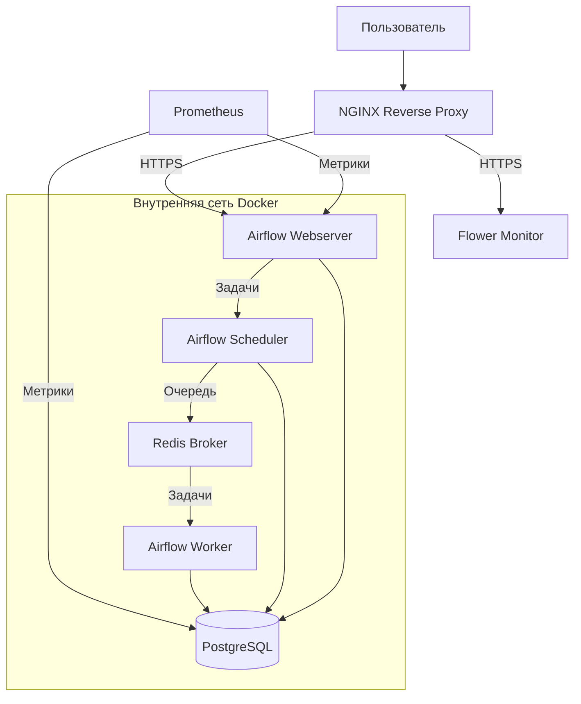

# Apache Airflow — Развертывание на облачном сервере


Production-готовый Apache Airflow 2.11.0 с CeleryExecutor, PostgreSQL, Redis, NGINX и мониторингом Prometheus.

## 📋 Содержание

- [Архитектура](#-архитектура)
- [Предварительные требования](#-предварительные-требования)
- [Установка и настройка](#-установка-и-настройка)
  - [1. Подготовка сервера](#1-подготовка-сервера)
  - [2. Клонирование репозитория](#2-клонирование-репозитория)
  - [3. Настройка переменных окружения](#3-настройка-переменных-окружения)
  - [4. Генерация секретных ключей](#4-генерация-секретных-ключей)
  - [5. Настройка SSL](#5-настройка-ssl)
  - [6. Настройка аутентификации](#6-настройка-аутентификации)
  - [7. Запуск системы](#7-запуск-системы)
- [Альтернативные порты](#-альтернативные-порты)
- [Доступ к сервисам](#-доступ-к-сервисам)
- [Безопасность](#-безопасность)
- [Резервное копирование](#-резервное-копирование)
- [Мониторинг](#-мониторинг)
- [Обслуживание](#-обслуживание)
- [Устранение неполадок](#-устранение-неполадок)
- [Часто задаваемые вопросы](#-часто-задаваемые-вопросы)
- [Лицензия](#-лицензия)

## 🏗️ Архитектура


## ⚙️ Предварительные требования

### Аппаратные требования
- **Минимум:** 4 ГБ RAM, 2 CPU, 20 ГБ диска
- **Рекомендуется:** 8 ГБ RAM, 4 CPU, 50 ГБ диска

### Программное обеспечение
- **Операционная система:** Ubuntu 20.04/22.04, Debian 10/11, CentOS 8
- **Docker:** версия 20.10+
- **Docker Compose:** версия 2.0+
- **Git:** для клонирования репозитория

### Сетевые порты
- **80/tcp** — HTTP (редирект на HTTPS)
- **443/tcp** — HTTPS (основной доступ)
- **9090/tcp** — Prometheus (опционально)
- **5555/tcp** — Flower (опционально)

## 🚀 Установка и настройка

### 1. Подготовка сервера

```bash
# Обновление системы
sudo apt update && sudo apt upgrade -y

# Установка Docker
curl -fsSL https://get.docker.com -o get-docker.sh
sudo sh get-docker.sh

# Установка Docker Compose
sudo apt install docker-compose-plugin -y

# Добавление пользователя в группу docker
sudo usermod -aG docker $USER
newgrp docker  # или перезайдите в систему
```

### 2. Клонирование репозитория

```bash
# Клонирование репозитория
git clone https://github.com/Alina-Bagaeva/Apache-Airflow.git
cd Apache-Airflow

# Проверка структуры файлов
ls -la
```

### 3. Настройка переменных окружения

```bash
# Копирование шаблона конфигурации
cp .env.example .env

# Редактирование конфигурации
nano .env  # или используйте ваш любимый редактор
```

**Важно:** Заполните ВСЕ поля в файле `.env`:

```bash
# === ОБЯЗАТЕЛЬНЫЕ БЕЗОПАСНОСТНЫЕ КЛЮЧИ ===
FERNET_KEY=ваш_сгенерированный_fernet_ключ
AIRFLOW_SECRET_KEY=ваш_сгенерированный_секретный_ключ

# === БАЗЫ ДАННЫХ ===
POSTGRES_PASSWORD=надежный_пароль_postgres
REDIS_PASSWORD=надежный_пароль_redis

# === ПОЛЬЗОВАТЕЛЬ AIRFLOW ===
_AIRFLOW_WWW_USER_USERNAME=admin
_AIRFLOW_WWW_USER_PASSWORD=надежный_пароль_админа

# === СЕРВЕРНАЯ КОНФИГУРАЦИЯ ===
# Укажите IP вашего сервера или доменное имя
DOMAIN_NAME=ВАШ IP или доменное имя
```

### 4. Генерация секретных ключей

```bash
# Генерация Fernet ключа (для шифрования паролей в БД)
python3 -c "from cryptography.fernet import Fernet; print(Fernet.generate_key().decode())"
# Пример: sWxLUzD7NZmUukwLk2Gyu_zN5N-JlaeFl2XubO8cHZU=

# Генерация Secret ключа (для подписи сессий)
python3 -c "import secrets; print(secrets.token_hex(32))"
# Пример: 90abaa83ed1a71c951b06d91c4aaef2f234fa41d54a289c0cde0c031003266b6

# Вставьте сгенерированные ключи в файл .env
```

### 5. Настройка SSL

#### Вариант A: Self-signed сертификат (для тестирования)

```bash
# Создание директории для SSL
mkdir -p nginx/ssl

# Генерация self-signed сертификата
openssl req -x509 -nodes -days 365 -newkey rsa:2048 \
  -keyout nginx/ssl/key.pem \
  -out nginx/ssl/cert.pem \
  -subj "/C=RU/ST=Moscow/L=Moscow/O=Company/CN=${DOMAIN_NAME}"

# Проверка сертификата
openssl x509 -in nginx/ssl/cert.pem -text -noout
```

#### Вариант B: Let's Encrypt (для продакшена)

```bash
# Установка Certbot
sudo apt install certbot python3-certbot-nginx -y

# Получение сертификата
sudo certbot certonly --standalone -d ${DOMAIN_NAME} --email your-email@example.com

# Копирование сертификатов
sudo cp /etc/letsencrypt/live/${DOMAIN_NAME}/fullchain.pem nginx/ssl/cert.pem
sudo cp /etc/letsencrypt/live/${DOMAIN_NAME}/privkey.pem nginx/ssl/key.pem
sudo chown $USER:$USER nginx/ssl/*.pem
```

### 6. Настройка аутентификации

```bash
# Установка утилиты htpasswd
sudo apt install apache2-utils -y

# Создание файла с паролями
htpasswd -c nginx/.htpasswd admin
# Введите пароль для пользователя admin

# Добавление дополнительных пользователей
htpasswd nginx/.htpasswd user2
```

### 7. Запуск системы

```bash
# Сборка и запуск контейнеров
docker compose up -d --build

# Проверка статуса
docker compose ps

# Просмотр логов
docker compose logs -f
```

## 🔄 Альтернативные порты

Если стандартные порты (80, 443, 9090, 5555) заняты другими сервисами, вы можете использовать альтернативные порты.

### Проверка свободных портов

```bash
# Проверить занятые порты
sudo netstat -tulpn | grep LISTEN
# Или
sudo ss -tulpn

# Проверить конкретный порт
sudo lsof -i :8081
```

### Альтернативные варианты портов

| Сервис | Стандартный порт | Альтернатива 1 | Альтернатива 2 | Альтернатива 3 |
|--------|------------------|----------------|----------------|----------------|
| **NGINX HTTP** | 80 | 8080 | 8081 | 8888 |
| **NGINX HTTPS** | 443 | 8443 | 9443 | 10443 |
| **Flower** | 5555 | 5556 | 5566 | 5656 |
| **Prometheus** | 9090 | 9091 | 9191 | 9292 |

### Настройка альтернативных портов

#### Способ 1: Изменение в docker-compose.yaml

Отредактируйте файл `docker-compose.yaml`:

```yaml
services:
  nginx:
    ports:
      - "8081:80"      # Вместо "80:80"
      - "8443:443"     # Вместо "443:443"
  
  flower:
    ports:
      - "5556:5555"    # Вместо "5555:5555"
  
  prometheus:
    ports:
      - "9091:9090"    # Вместо "9090:9090"
```

#### Способ 2: Использование файла переопределения

Создайте файл `ports-override.yaml`:

```yaml
# ports-override.yaml
services:
  nginx:
    ports:
      - "8081:80"
      - "8443:443"
  
  flower:
    ports:
      - "5556:5555"
  
  prometheus:
    ports:
      - "9091:9090"
```

Запустите с переопределением:
```bash
docker compose -f docker-compose.yaml -f ports-override.yaml up -d
```

#### Способ 3: Настройка через .env файл

Добавьте в `.env`:
```bash
# Укажите порт в доменном имени
DOMAIN_NAME=ВАШ IP:8443

# Или отдельно
NGINX_HTTP_PORT=8081
NGINX_HTTPS_PORT=8443
FLOWER_PORT=5556
PROMETHEUS_PORT=9091
```

### Обновление конфигурации NGINX

Если меняете порты NGINX, обновите `nginx/conf.d/airflow.conf`:

```nginx
server {
    listen 8081;        # Вместо 80
    server_name ${DOMAIN_NAME};
    return 301 https://$server_name:8443$request_uri;
}

server {
    listen 8443 ssl http2;  # Вместо 443
    server_name ${DOMAIN_NAME};
    
    # Обновите proxy заголовки
    location / {
        proxy_pass http://airflow_backend;
        proxy_set_header Host $host:8443;
        proxy_set_header X-Forwarded-Port 8443;
        # ... остальные заголовки
    }
}
```

### Открытие портов в фаерволе

Не забудьте открыть новые порты:
```bash
sudo ufw allow 8443/tcp
sudo ufw allow 8081/tcp
sudo ufw allow 5556/tcp
sudo ufw allow 9091/tcp
```

### Рекомендованные комбинации портов

**Для тестового окружения:**
- Airflow UI: `https://сервер:8443`
- Flower: `https://сервер:5556`
- Prometheus: `http://сервер:9091`

**Для продакшена с доменом:**
- Airflow UI: `https://airflow.ваш-домен.com` (стандартные 443)
- Flower: `https://flower.ваш-домен.com` (стандартные 443 через поддомен)
- Prometheus: `https://metrics.ваш-домен.com` (стандартные 443 через поддомен)

## 🌐 Доступ к сервисам

После успешного запуска сервисы будут доступны по следующим адресам:

### Стандартные порты:
| Сервис | URL | Порт | Описание |
|--------|-----|------|----------|
| **Airflow UI** | `https://ваш-сервер-ip` | 443 | Основной веб-интерфейс Airflow |
| **Flower** | `https://ваш-сервер-ip:5555` | 5555 | Мониторинг Celery workers |
| **Prometheus** | `http://ваш-сервер-ip:9090` | 9090 | Метрики и мониторинг |
| **Airflow API** | `https://ваш-сервер-ip/api/v1/` | 443 | REST API Airflow |
| **Health Check** | `https://ваш-сервер-ip/health` | 443 | Проверка здоровья системы |

### Альтернативные порты (если заняты стандартные):
| Сервис | URL | Порт | Описание |
|--------|-----|------|----------|
| **Airflow UI** | `https://ваш-сервер-ip:8443` | 8443 | Основной веб-интерфейс Airflow |
| **Flower** | `https://ваш-сервер-ip:5556` | 5556 | Мониторинг Celery workers |
| **Prometheus** | `http://ваш-сервер-ip:9091` | 9091 | Метрики и мониторинг |

### Первый вход в Airflow

1. Откройте браузер: `https://ваш-сервер-ip` (или `https://ваш-сервер-ip:8443` если используете альтернативные порты)
2. Введите базовую аутентификацию:
   - Логин: `admin` (из `.htpasswd`)
   - Пароль: указанный при создании `.htpasswd`
3. Войдите в Airflow:
   - Логин: `admin` (из `_AIRFLOW_WWW_USER_USERNAME`)
   - Пароль: указанный в `_AIRFLOW_WWW_USER_PASSWORD`

## 🔒 Безопасность

### Контрольный список безопасности

- [ ] **Смените все пароли** в `.env` файле
- [ ] **Используйте SSL сертификаты** от Let's Encrypt
- [ ] **Настройте файрвол**:
  ```bash
  # Разрешить только необходимые порты
  sudo ufw allow 22/tcp      # SSH
  sudo ufw allow 80/tcp      # HTTP (или альтернативный порт)
  sudo ufw allow 443/tcp     # HTTPS (или альтернативный порт)
  sudo ufw --force enable
  ```

- [ ] **Ограничьте доступ по IP** в `nginx/conf.d/airflow.conf`:
  ```nginx
  location ~ ^/(api/v1/|flower|variables|connections) {
    allow 192.168.1.0/24;    # Ваша локальная сеть
    allow 10.0.0.0/8;        # Внутренняя сеть
    deny all;
  }
  ```

- [ ] **Регулярно обновляйте** контейнеры:
  ```bash
  docker compose pull
  docker compose up -d
  ```

### Рекомендуемые настройки безопасности

1. **Двухфакторная аутентификация** (опционально):
   ```bash
   # В .env добавьте:
   AIRFLOW__WEBSERVER__AUTHENTICATE=true
   AIRFLOW__API__AUTH_BACKENDS=airflow.api.auth.backend.session
   ```

2. **Автоматическое обновление сертификатов**:
   ```bash
   # Добавьте в crontab
   0 3 * * * certbot renew --quiet && docker compose restart nginx
   ```

## 💾 Резервное копирование

### Автоматическое резервное копирование

```bash
# Сделайте скрипт исполняемым
chmod +x backup.sh

# Ручной запуск бэкапа
./backup.sh
# Бэкап создается в папке ./backups/

# Автоматизация через cron
crontab -e
# Добавьте строку:
0 2 * * * /путь/к/Apache-Airflow/backup.sh
```

### Восстановление из бэкапа

```bash
# Остановите Airflow
docker compose stop airflow-webserver airflow-scheduler

# Восстановите базу данных
docker compose exec -T postgres psql -U airflow -d airflow < backups/ваш_бэкап.sql

# Запустите Airflow
docker compose start airflow-webserver airflow-scheduler
```

## 📊 Мониторинг

### Prometheus метрики

Prometheus собирает метрики:
- **Airflow Webserver**: `https://ваш-сервер-ip/metrics`
- **PostgreSQL**: внутренние метрики БД

### Настройка алертов (опционально)

Создайте файл `prometheus/alerts.yml`:

```yaml
groups:
  - name: airflow_alerts
    rules:
      - alert: AirflowSchedulerDown
        expr: up{job="airflow-scheduler"} == 0
        for: 5m
        labels:
          severity: critical
        annotations:
          summary: "Airflow Scheduler is down"
          
      - alert: HighDAGFailureRate
        expr: rate(airflow_dagrun_failed[10m]) > 0.1
        for: 5m
        labels:
          severity: warning
```

## 🛠️ Обслуживание

### Команды управления

```bash
# Проверка состояния
docker compose ps
docker compose logs --tail=50

# Перезапуск сервисов
docker compose restart airflow-scheduler
docker compose restart nginx

# Обновление контейнеров
docker compose pull
docker compose up -d

# Очистка неиспользуемых данных
docker system prune -a --volumes
```

### Управление DAGs

```bash
# Пауза/распауза DAG
docker compose exec airflow-webserver airflow dags pause dag_id
docker compose exec airflow-webserver airflow dags unpause dag_id

# Запуск DAG вручную
docker compose exec airflow-webserver airflow dags trigger dag_id

# Просмотр логов DAG
docker compose exec airflow-webserver airflow tasks list dag_id
```

### Масштабирование воркеров

```bash
# Измените в .env:
WORKER_MEMORY_LIMIT=8G
WORKER_CPUS=4

# Перезапустите воркер
docker compose up -d --force-recreate airflow-worker
```

## 🐛 Устранение неполадок

### Общие проблемы

#### 1. **Ошибка SSL сертификата**
```
Невозможно установить безопасное соединение
```
**Решение:**
```bash
# Проверьте сертификаты
openssl x509 -in nginx/ssl/cert.pem -text -noout

# Перезапустите NGINX
docker compose restart nginx
```

#### 2. **Airflow не запускается**
```
airflow.db.migrations.exceptions.DatabaseNotReady: Database not ready
```
**Решение:**
```bash
# Проверьте PostgreSQL
docker compose logs postgres

# Принудительная пересборка
docker compose down -v
docker compose up -d
```

#### 3. **Ошибка подключения к базе данных**
```
psycopg2.OperationalError: could not connect to server
```
**Решение:**
```bash
# Проверьте пароль в .env
echo $POSTGRES_PASSWORD

# Проверьте контейнер PostgreSQL
docker compose exec postgres pg_isready -U airflow
```

#### 4. **Порт уже занят**
```
Bind for 0.0.0.0:80 failed: port is already allocated
```
**Решение:**
1. Используйте [альтернативные порты](#-альтернативные-порты)
2. Освободите порт:
   ```bash
   # Найти процесс, использующий порт
   sudo lsof -i :80
   sudo lsof -i :443
   
   # Остановить процесс (если это возможно)
   sudo systemctl stop nginx  # если это системный nginx
   ```

### Полезные команды диагностики

```bash
# Проверка здоровья всех сервисов
docker compose ps --services | xargs -I {} sh -c 'echo "=== {} ===" && docker compose exec {} curl -s http://localhost:8080/health 2>/dev/null || echo "Health check not available"'

# Проверка свободного места
df -h
docker system df

# Проверка сетевых соединений
docker network inspect airflow-airflow-network

# Просмотр логов в реальном времени
docker compose logs -f --tail=100

# Проверка занятых портов
sudo netstat -tulpn | grep LISTEN
```

## ❓ Часто задаваемые вопросы

### Q: Как добавить новый DAG?
**A:** Есть два способа добавить новый DAG:

#### Способ 1: Через веб-интерфейс Airflow Code Editor (рекомендуется)
1. Войдите в Airflow UI (`https://ваш-сервер`)
2. В верхнем меню выберите **Admin → Airflow Code Editor**
3. В левой панели навигации перейдите в папку `/opt/airflow/dags/`
4. Нажмите кнопку **"New File"** или **"New Folder"**
5. Создайте новый Python файл (например: `my_new_dag.py`)
6. Напишите код DAG и нажмите **"Save"**
7. DAG автоматически появится в списке через 30-60 секунд

#### Способ 2: Через файловую систему
1. Добавьте Python файл в локальную папку `./dags/`
2. Пример структуры:
```bash
Apache-Airflow/
└── dags/
    ├── dag_with_clickhouse.py  # существующий DAG
    └── my_new_dag.py          # новый DAG

Airflow автоматически обнаружит его через 30-60 секунд.

### Q: Как изменить пароль администратора?
**A:**
```bash
# 1. Измените пароль в .env (переменная _AIRFLOW_WWW_USER_PASSWORD)
# 2. Пересоздайте пользователя
docker compose exec airflow-webserver airflow users create \
  --username admin \
  --firstname Admin \
  --lastname User \
  --role Admin \
  --email admin@example.com \
  --password новый_пароль
```

### Q: Что делать, если порты 80 и 443 заняты?
**A:** Используйте альтернативные порты как описано в разделе [Альтернативные порты](#-альтернативные-порты). Например:
- Используйте 8081 для HTTP и 8443 для HTTPS
- Обновите конфигурацию NGINX и docker-compose.yaml
- Откройте новые порты в фаерволе

### Q: Как настроить отправку email уведомлений?
**A:** Добавьте в `.env`:
```bash
AIRFLOW__SMTP__SMTP_HOST=smtp.gmail.com
AIRFLOW__SMTP__SMTP_USER=ваш_email@gmail.com
AIRFLOW__SMTP__SMTP_PASSWORD=ваш_пароль
AIRFLOW__SMTP__SMTP_PORT=587
AIRFLOW__SMTP__SMTP_MAIL_FROM=ваш_email@gmail.com
```

### Q: Как увеличить объем памяти для воркеров?
**A:** Измените в `.env`:
```bash
WORKER_MEMORY_LIMIT=8G
WORKER_MEMORY_RESERVATION=4G
```
Затем перезапустите: `docker compose up -d airflow-worker`

### Q: Как обновить версию Airflow?
**A:**
```bash
# 1. Обновите версию в requirements.txt
# 2. Обновите версию в Dockerfile
# 3. Пересоберите образы
docker compose down
docker compose build --no-cache
docker compose up -d
```

### Q: Можно ли использовать доменное имя вместо IP?
**A:** Да, укажите доменное имя в переменной `DOMAIN_NAME` в файле `.env`:
```bash
DOMAIN_NAME=airflow.ваш-домен.com
```
Не забудьте настроить DNS записи для вашего домена.

## 📄 Лицензия

Этот проект использует Apache License 2.0. См. файл [LICENSE](LICENSE) для подробностей.

---

## 📞 Поддержка

Если у вас возникли проблемы:

1. **Проверьте логи:** `docker compose logs`
2. **Убедитесь, что все порты открыты:** `sudo ufw status`
3. **Проверьте SSL сертификаты:** `openssl s_client -connect ваш-сервер:443`
4. **Проверьте занятые порты:** `sudo netstat -tulpn`
5. **Создайте issue** в репозитории GitHub

---

**Примечание:** Эта конфигурация предназначена для production использования. Всегда тестируйте изменения в staging-окружении перед применением на продакшене.

**Автор:** Alina Bagaeva  
**Репозиторий:** https://github.com/Alina-Bagaeva/Apache-Airflow  
**Версия:** 1.0.0  
**Последнее обновление:** Январь 2026
